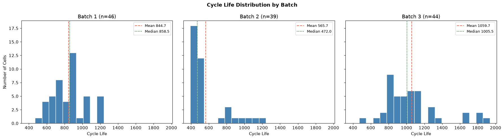
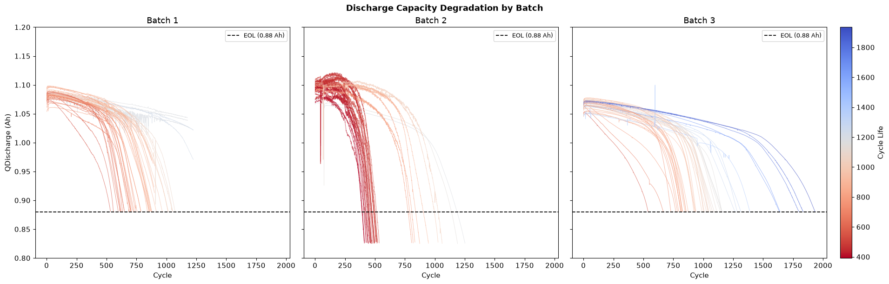
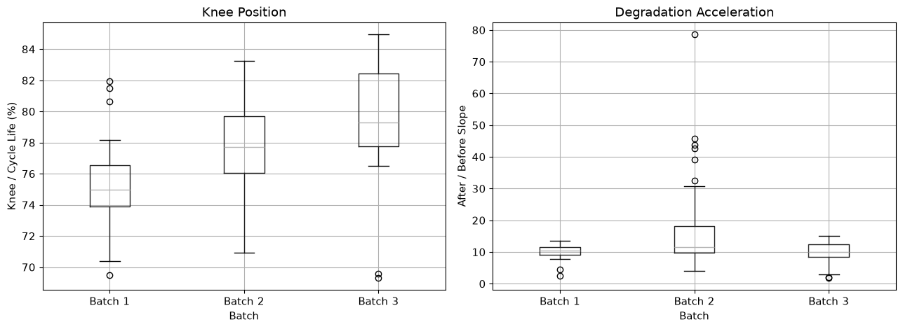
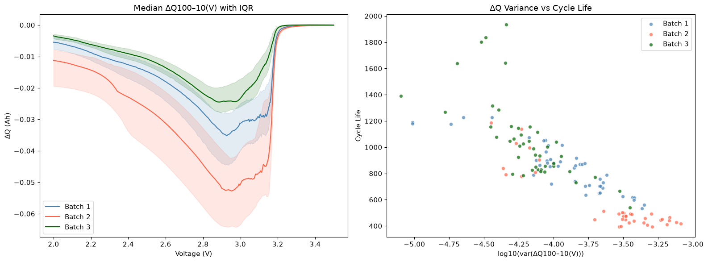
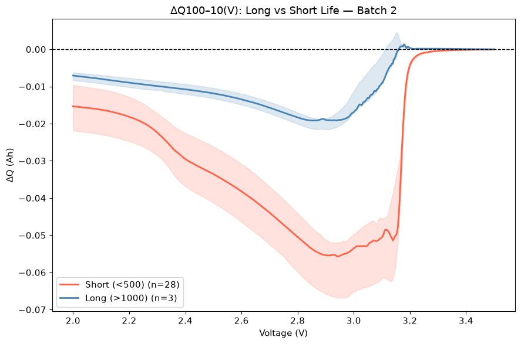
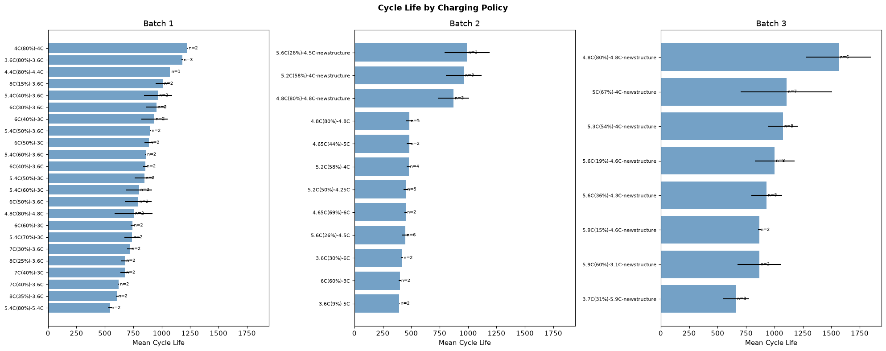
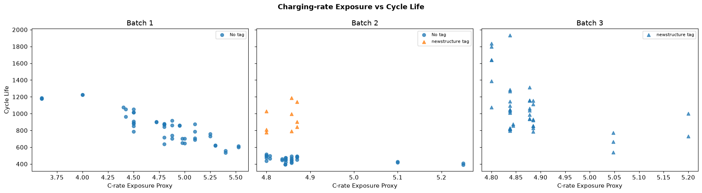
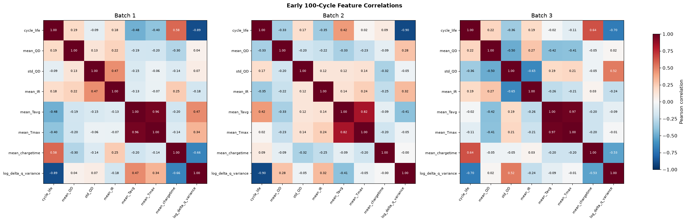

# ESS 배터리 수명 예측

배터리의 초기 100사이클 데이터만으로 EOL(초기 용량의 80% 도달)까지의 총 Cycle Life를 예측하는 프로젝트이다. 장기간 수명시험이 끝나기 전에 배터리 수명을 추정하여 셀 조기 선별, ESS 유지보수 의사결정을 지원하는 것을 목표로 한다.

## 프로젝트 개요

- 데이터셋 : MIT–Stanford Battery Dataset (Severson et al., Nature Energy 2019)
- 학습 데이터 : Batch 1 (`2017-05-12`)
- 평가 데이터 : Batch 2 (`2018-02-20`)
- 태스크 : Regression (Cycle Life 예측)
- Target : `cycle_life`
- 입력 범위 : 각 셀의 초기 100사이클
- 최종 입력 피처 : `log_delta_q_variance`, `mean_chargetime`
- 선정 모델 : Ridge Regression

## 파일 구조

```text
.
├── data/
│   └── README.md
├── notebooks/
│   ├── 01_EDA.ipynb
│   ├── 02_feature_engineering.ipynb
│   └── 03_modeling.ipynb
├── src/
│   ├── preprocess.py
│   ├── features.py
│   └── train.py
├── results/
│   ├── README.md
│   └── model_performance.csv
├── requirements.txt
└── README.md
```

## 환경 설정

Python 3.14.6

```bash
git clone https://github.com/sugi136/data-mini-prj.git
cd data-mini-prj

python3 -m venv .venv
source .venv/bin/activate
python -m pip install --upgrade pip
pip install -r requirements.txt

python -m ipykernel install --user \
  --name data-mini-prj \
  --display-name "Python (data-mini-prj)"
```

## EDA

### Cycle Life 분포



그래프 : 동일한 bin과 축으로 Batch별 수명 분포 비교. Batch 2는 짧은 수명에 집중되고 Batch 3는 긴 수명까지 분포한다.

- Batch 1 : 46개, 534~1,227사이클, 평균 844.7사이클
- Batch 2 : 유효 Target 39개, 392~1,186사이클, 평균 565.7사이클
- Batch 3 : 유효 Target 44개, 541~1,935사이클, 평균 1,059.7사이클
- 전체 유효 셀 : 129개, 장수명(`>1,000`) 36개(27.9%), 단수명(`<500`) 28개(21.7%). 단수명 셀은 모두 Batch 2에 존재한다.

| Batch   |  중앙값 | 장수명 개수·비율 | 단수명 개수·비율 | 분포 특징                                                                |
| ------- | ------: | ---------------: | ---------------: | ------------------------------------------------------------------------ |
| Batch 1 |   858.5 |     10개 · 21.7% |       0개 · 0.0% | 중앙 50%가 703.25~914.25사이클에 집중, IQR 기준 이상치 없음              |
| Batch 2 |   472.0 |       3개 · 7.7% |     28개 · 71.8% | 짧은 수명에 집중되고 긴 수명 방향으로 꼬리가 이어짐, IQR 상단 이상치 9개 |
| Batch 3 | 1,005.5 |     23개 · 52.3% |       0개 · 0.0% | 평균 수명과 표준편차가 가장 큼, IQR 상단 이상치 1,801·1,836·1,935사이클  |

- 비율 기준 : 각 Batch의 유효 Target 셀 수. IQR 이상치 기준 : `Q1 − 1.5 × IQR`, `Q3 + 1.5 × IQR` 범위 밖.
- 단수명 셀은 특정 충전 프로토콜에서 반복적으로 관찰되지만, 이것만으로 짧은 수명의 원인을 확정할 수는 없다.
- 장수명 상단 이상치에서 `newstructure` 태그가 관찰된다. 충전 정책 문자열의 태그이며, 물리적 셀 구조 변경을 의미한다고 단정하지 않는다.
- 핵심 발견 : Batch별 Target 분포 차이가 커서 데이터를 합친 무작위 분할보다 Batch 단위 외부 평가가 필요하다.

### 열화 곡선 분석



그래프 : 색상은 실제 Cycle Life, 점선은 EOL 기준 0.88 Ah. 초기에는 용량 차이가 작고 후반부에 급격한 감소가 나타난다.



그래프 : 왼쪽은 전체 수명 대비 Knee 위치, 오른쪽은 Knee 이후·이전 기울기 절댓값의 비율. 비율이 1보다 크면 후기 열화가 더 빠르다.

- 방전 용량은 일정하게 감소하지 않고 수명 후반부에 급격히 감소한다.
- 그래프 비교 기준 : `0.5 ≤ QDischarge ≤ 1.3 Ah`의 행 사용, EOL 기준선 `0.88 Ah`.
- 초기 용량 유지 → 중간 완만한 감소 → 후기 빠른 감소. 짧은 수명의 셀은 더 이른 절대 사이클에서 Knee가 나타나고, 긴 수명의 셀은 더 늦게 나타나는 경향.
- Knee point는 평균적으로 전체 수명의 약 75~80% 지점에서 관찰된다.

| Batch   | Knee 분석 셀 수 | 평균 Knee 사이클 | 평균 Knee/수명 비율 | Knee 이전 평균 기울기 | Knee 이후 평균 기울기 |
| ------- | --------------: | ---------------: | ------------------: | --------------------: | --------------------: |
| Batch 1 |              36 |            592.9 |               75.2% |                -0.084 |                -0.793 |
| Batch 2 |              39 |            442.2 |               77.6% |                -0.118 |                -1.533 |
| Batch 3 |              44 |            847.2 |               79.8% |                -0.071 |                -0.641 |

- 기울기 단위 : mAh/사이클. 음수의 절댓값이 클수록 빠른 용량 감소.
- Knee 추정 기준 : 21개 관측값 이동 중앙값으로 평활화 후, 두 선형 구간의 잔차 제곱합이 최소가 되는 분할점. 최종 방전 용량이 `0.90 Ah` 이하인 셀만 분석.
- 배치 비교 : 단수명 셀이 많은 Batch 2에서 Knee 이후 평균 감소 속도가 가장 큼. 배치별 평균이며 장·단수명 그룹만의 독립적인 속도 비교는 아님.
- 핵심 발견 : Knee 이후 열화 속도가 크게 증가하지만, 전체 수명으로 계산한 Knee 값은 미래 정보이므로 모델 입력에서 제외한다.

### ΔQ(V) 곡선 분석



그래프 : 왼쪽은 Batch별 ΔQ 중앙값과 IQR, 오른쪽은 로그 분산과 Cycle Life의 관계.



그래프 : Batch 2 내부의 단수명 28개·장수명 3개 셀 비교. 선은 중앙값, 음영은 IQR이며 단수명 그룹에서 더 큰 음의 변화가 나타난다.

- `ΔQ100–10(V) = Q100(V) - Q10(V)`로 계산했다.
- 단수명 셀은 장수명 셀보다 음의 변화 폭과 분산이 크게 나타났다.
- 비교 대상 : Batch 2 내부의 장수명 3개 셀과 단수명 28개 셀. 곡선은 공통 전압 축의 중앙값과 IQR로 비교.
- 곡선 형태 : 두 그룹 모두 중간 전압 구간에서 음의 골이 나타나며, 단수명 그룹의 골이 더 깊고 고전압 끝에서는 0 부근으로 접근.

| Batch 2 수명 그룹 | 셀 수 | 평균 ΔQ (Ah) | 셀별 ΔQ 최솟값의 평균 (Ah) | 평균 로그 분산 |
| ----------------- | ----: | -----------: | -------------------------: | -------------: |
| 장수명 (`>1,000`) |     3 |      -0.0092 |                    -0.0208 |        -4.3169 |
| 단수명 (`<500`)   |    28 |      -0.0300 |                    -0.0615 |        -3.3854 |

- 표의 값 : 셀별 곡선 통계량을 수명 그룹별로 평균한 값. 장수명 표본은 3개이므로 해석에 표본 수 고려.
- `log10(var(ΔQ100–10))`와 Cycle Life의 상관계수는 Batch별 `-0.702~-0.902`이다.
- Pearson 상관계수 : Batch 1 `-0.886`, Batch 2 `-0.902`, Batch 3 `-0.702`.
- 핵심 발견 : `log_delta_q_variance`를 핵심 수명 예측 피처로 선정했다.

### 충전 속도(C-rate)와 수명의 관계



그래프 : 정책별 평균 수명과 표준편차 비교. n은 해당 정책의 유효 셀 수.



그래프 : C-rate 노출도와 Cycle Life의 산점도. 마커는 정책 문자열의 newstructure 태그 유무를 구분한다.

- 높은 C-rate가 항상 단수명을 의미하지는 않았다.
- 최대 C-rate뿐 아니라 해당 전류가 적용된 충전 구간도 함께 고려해야 한다.

| Batch 1 충전 프로토콜 | 셀 수 | 평균 수명 (사이클) |
| --------------------- | ----: | -----------------: |
| `4C(80%)-4C`          |     2 |            1,226.5 |
| `5.4C(80%)-5.4C`      |     2 |              546.5 |
| `8C(15%)-3.6C`        |     2 |            1,008.5 |
| `8C(25%)-3.6C`        |     2 |              676.5 |
| `8C(35%)-3.6C`        |     2 |              607.5 |

- 같은 최대 8C 조건에서도 적용 구간에 따라 평균 수명 차이 관찰. 정책당 2개 셀로, 인과관계보다 경향 수준으로 해석.
- C-rate 노출도–수명 Spearman 상관계수 : Batch 1 `-0.869`, Batch 2 `-0.180`, Batch 3 `-0.515`. 배치별 관계 강도 차이.
- C-rate 노출도 : 80% SOC까지 각 전류가 적용되는 용량 구간으로 가중한 비교 지표. 실제 시간 평균 전류는 아님.
- Batch 1의 Knee 분석 대상 36개 셀에서 노출도–Knee 이전 열화 속도 `+0.763`, 노출도–Knee 이후 열화 속도 `+0.664`의 Spearman 상관관계 관찰. 전체 수명에서 구한 열화 속도는 EDA 해석에만 사용.
- 핵심 발견 : 충전 조건의 영향을 반영하는 초기 평균 충전 시간 `mean_chargetime`을 두 번째 피처로 선정했다.

### 초기 피처 상관관계 및 다중공선성



그래프 : 피처·Target 간 Pearson 상관계수. 로그 분산은 수명과 음의 관계, 두 온도 피처는 서로 높은 양의 관계를 보인다.

- `log_delta_q_variance`가 모든 Batch에서 Cycle Life와 가장 강하고 일관된 음의 관계를 보였다.
- `mean_Tavg`와 `mean_Tmax`는 높은 상관관계를 보여 중복 정보 가능성이 확인됐다.
- `mean_chargetime`–수명 Pearson 상관계수 : Batch 1 `+0.577`, Batch 2 `+0.087`, Batch 3 `+0.637`. Batch 2에서는 관계가 약해 외부 일반화의 한계로 고려.
- 온도 피처끼리의 Pearson 상관계수 : Batch 1 `0.956`, Batch 2 `0.825`, Batch 3 `0.972`. 두 온도 피처 모두 최종 입력에서 제외.
- 핵심 발견 : 소표본에서 불필요한 복잡도를 줄이기 위해 최종 입력을 두 피처로 제한했다.

## Modeling

### 피처 엔지니어링 전략

각 셀의 초기 100사이클을 하나의 행으로 요약한다.

| 피처                   | 의미                                          | 선정 근거                                                                    |
| ---------------------- | --------------------------------------------- | ---------------------------------------------------------------------------- |
| `log_delta_q_variance` | 10사이클과 100사이클 사이 ΔQ(V) 분산의 로그값 | Cycle Life와 강하고 일관된 음의 관계                                         |
| `mean_chargetime`      | 초기 100사이클 평균 충전 시간                 | 평균 충전 시간Batch 1·3에서 Cycle Life와 양의 상관관계 관찰 (+0.577, +0.637) |

다음 값은 모델 입력에서 제외한다.

- Knee point 및 Knee 이후 기울기 : 전체 수명 정보를 사용하는 미래 정보
- `cycle_life`에서 만든 장·단수명 변수 : Target Leakage
- `batch`, `cell_id` : 데이터 식별자
- `mean_Tmax` : 다른 온도 피처와 높은 다중공선성

### 모델 선택 및 근거

- 후보 모델 :

| 후보 모델         | 선정 이유                                 |
| ----------------- | ----------------------------------------- |
| Linear Regression | 선형관계의 가장 단순한 모델               |
| Ridge Regression  | 소표본, 선형 관계, 계수 폭주 방지         |
| ElasticNet        | 과적합 억제, 소표본, 선형 관계, 계수 축소 |
| SVR               | 비선형 관계 학습, 소표본                  |
| Random Forest     | 비선형, 상호작용 학습 가능                |

- 기준 모델 : DummyRegressor (`strategy="mean"`). 학습 데이터의 평균 수명을 예측하며, Ridge와 동일한 Train CV·Valid·Test에서 MAPE를 비교한다.
- 최종 모델 : Ridge Regression (선형 모델이면서 피처 간 상관관계 및 과적합 가능성을 고려해 선정)
- 선택 이유 :
  - 학습 표본이 46개이므로 모델 복잡도를 제한한다.
  - 입력 피처가 2개이므로 불필요한 피처 제거보다 두 피처를 유지하는 방향으로 설계한다.
  - Batch 1에서 `log_delta_q_variance`와 Cycle Life의 Pearson 상관계수가 `-0.886`으로, 음의 선형 관계를 지지한다.
  - 해당 산점도가 전체적으로 왼쪽 위에서 오른쪽 아래로 내려가는 형태를 보인다.
  - ΔQ 분산의 로그 변환은 분포 왜곡을 완화하고 선형 관계를 강화하려는 목적으로 적용한다.

## 성능 결과

모델 학습 후 다음 지표를 Batch별로 기록한다.

| 구분                     | MAPE (%) | 비고                          |
| ------------------------ | -------: | ----------------------------- |
| Train (Batch 1 CV)       |     9.61 | Train 내부 Nested CV          |
| Valid (Batch 1 Hold-out) |     7.46 | Hold-out 10개 셀              |
| Test (Batch 2)           |    29.43 | Batch 1 전체 재학습 후 평가   |
| Gap (Train-Valid)        |    -2.15 | (+) : 과적합 의심             |
| Gap (Valid-Test)         |    21.97 | (+) : 배치간 일반화 저하 의심 |
| Gap (Target-Test)        |    20.33 | Target : 원논문 9.1%          |

## 오류 분석

### 모델이 가장 크게 틀린 셀의 공통점

- 절대·백분율 오차 상위 5개 : 모두 과대예측, 두 목록에서 4개 셀 중복
- 백분율 오차 상위 셀 : 6, 15, 18, 2, 29
- 실제 수명 393~452사이클 → Batch 1 학습 수명 범위 534~1,227 밖
- 반복 정책 : 3.6C(9%)-5C, 5.2C(50%)-4.25C 각각 2개
- 최대 절대 오차 : 셀 18, +302.8사이클
- 최대 백분율 오차 : 셀 6, 71.66%
- 예외 : 절대 오차 상위 셀 9는 학습 수명 범위 안에서도 과대예측

### 원인 가설 및 개선 방향

- 원인 가설 : 학습 데이터의 단수명 셀 부재 → 짧은 수명 영역의 예측 한계
- 원인 가설 : 배치별 피처–수명 관계 차이 → Batch 1 회귀식의 외부 일반화 저하
- 개선 방향 : 독립적인 단수명 학습 데이터 확보
- 개선 방향 : 정책별 오차·피처 분포·수명 관계 추가 검증
- 개선 방향 : 추가 피처 실험은 학습 데이터 내부에서 검증하고 새 외부 데이터로 평가

## ESS 도메인 해석

### 의사결정 활용

- 품질관리 : 초기 100사이클 기반 수명 예측으로 추가 검사, 수명시험 대상 셀의 우선순위 설정
- 유지보수 : 예상 총수명을 점검, 교체 계획의 참고 정보로 활용

### 한계 및 실 배포 요구사항

- Batch 2에서 MAPE가 29.43%로 증가해 다른 배치에 대한 일반화 성능이 제한적이다.
- 단수명 셀의 수명을 과대예측하는 경향이 있어, 점검, 교체 계획에 활용하기 전 추가 검증이 필요하다.
- 실제 BESS의 온도, SOC, 부하 조건을 반영한 데이터를 확보하고, 별도 현장 데이터로 성능을 검증해야 한다.

## 참고문헌

- Severson, K. A. et al. (2019). Data-driven prediction of battery cycle life before capacity degradation. _Nature Energy_, 4, 383–391. https://doi.org/10.1038/s41560-019-0356-8

## 팀 구성

- 손수경 : EDA, 피처 엔지니어링, 모델 개발, 성능 평가(Batch2)
